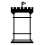
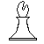
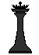
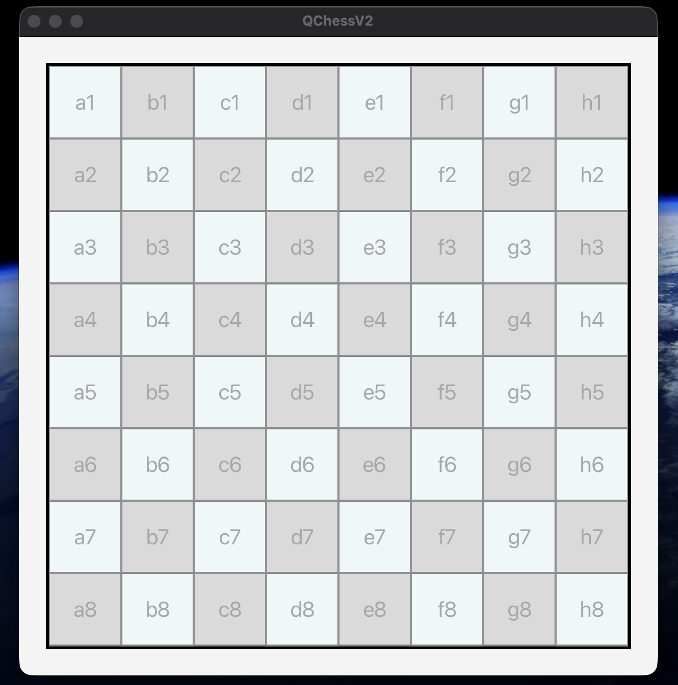
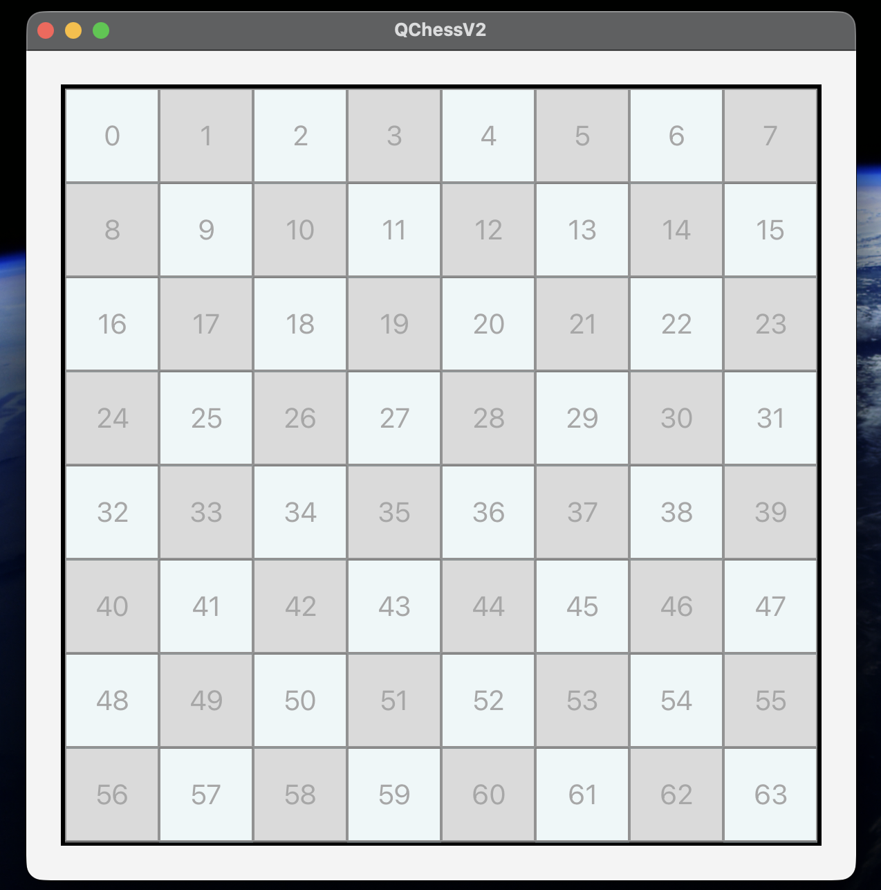
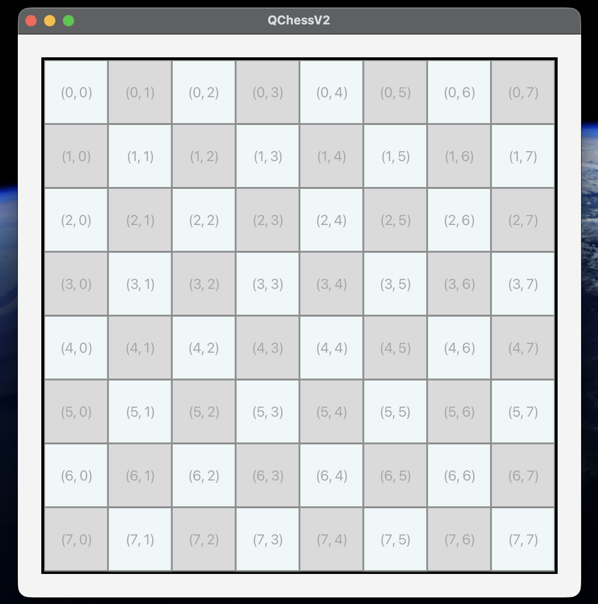

# QChess Version 2








## Background
After taking CS1302 at UGA I was able to create this over 2025 Christmas break.
QChessV1 is hardly comparable to this version. QChessV1 is based around Java
Swing and was made purely to become Chess and nothing more.

The purpose of this is essentially to be an open source chess component for JavaFX. 
My personal objective in making this was to create a CS1302 capstone project in addition to the one I made for the class.

I will use this framework to make a simple chess app that utilizes APIs which will
serve as the foreseeable endpoint to my chess endeavors. Until then, I will keep improving this.

⚠︎ Project Warnings
* Not fully tested/unstable
* Not yet fully customizable
* Enpassant is hard coded (unfortunately)

Features added to version 2:
* Checkmate
* Stalemate
* Events
* Much more customization options
* 2 More grid systems
* Vectors and scalars
* Overhauled piece movement system
* and probably more

- -

Future Features
* Chess960 castling compatability
* Non-hardcoded enpassant
* New vector that allows chess piece wall hacks

## Contribution
Feel free to contribute, just run tests and stuff. I will have to approve
any pushes though.

## Java Version
*java 24.0.2 2025-07-15*

*Java(TM) SE Runtime Environment (build 24.0.2+12-54)*

## Installation
Not yet on maven

## Grid Systems
#### Algebraic Notation


This system is not used for internal or chess piece functionality. It primarily serves
as the way to communicate through chess.
- - -

#### BtnID System

This system is used for some internal functionality but will eventually
be used to allow vectors to go across the chess board.

- - -

#### Coordinate System (the normal one)

This system is primarily used to create new chess pieces and
add functionality.


## How to Use
The chessboard is a JavaFX component so some JavaFX knowledge is a must.
(Make sure you add the chessboard to your root).
### 🏁 Creating a chessboard 🏁
Create an empty chessboard using the builder.
```
chessBoard = ChessBoard.newBuilder()
        .emptyChessBoard()
        .build()
;
```
---
Add pieces to your chess board.
```
chessBoard = ChessBoard.newBuilder()
        .emptyChessBoard()
        .add(new Pawn(new Coordinate(4, 4), Team.Black))
        .build()
;
```

---

Create a normal chessboard using the builder.
```
chessBoard = ChessBoard.newBuilder()
        .normalChessBoard()
        .build()
;
```
---
All normal chess rules are automatically enabled, but you can disable them using builder methods. 
You cannot re-enable them after the chess board is made.
```
chessBoard = ChessBoard.newBuilder()
        .normalChessBoard()
        .disableAutoTeamSwitch()
        .disableCheck()
        .disableCheckMate()
        .disableDraw()
        .disableCastling()
        .disablePromotion()
        .build()
;
```

---
Make sure to launch your chessboard when you want it to start.
```
chessBoard.launchGame();
```

### → Vectors and Scalars ••
For QChess purposes, all vectors and scalars do is hold the coordinate values which indicate where a chess piece can move.

A vector is defined by its magnitude and direction where its direction isn't a angle
but the rate of change of the row and column with respect to the start position. A scalar is primarily
defined by a single point's change in row and column with respect to the start position.

Both vectors and scalars can hold multiple coordinates but only scalars can define any point
that a chess piece can move to. When either have multiple coordinates, each coordinate becomes dependent
on each other. For example, when a coordinate has a chess piece
in the way, the rest of the coordinates for that particular vector
or scalar do not show as playable moves.

For this reason, coordinates are sorted based on proximity to the current position. (closest comes first).

If you do not want this dependency then you should make multiple
scalars. Since vectors can only be created with respect to the current position, vectors are *always* dependent
on the coordinates defined in that vector.

For example, the playables for a knight can be defined only by scalars, a king's playable moves can be defined by either a 
vector or scalar and a Rook's moves by (painfully) scalars or (very easily) by vectors.


### ♜ Creating a custom piece ♜
#### Basic chess piece example
This is essentially a bishop.
```
import qchess.chess.create.direction.ChessDirection;
import qchess.chess.create.direction.PieceVector;
import qchess.chess.create.ChessPiece;
import qchess.chess.create.Coordinate;
import qchess.chess.create.Team;

import java.util.ArrayList;
import java.util.Collections;
import java.util.List;

public class MyChessPiece extends ChessPiece {
    static final String WhiteTeamGraphic = "file:myWhiteTeamGraphic.png";
    static final String BlackTeamGraphic = "file:myBlackTeamGraphic.png";

    public MyChessPiece(Coordinate coordinate, Team team) {
        super(coordinate, team, WhiteTeamGraphic, BlackTeamGraphic);
    }

    @Override
    public List<ChessDirection> getRawPlayableDirections() {
        List<ChessDirection> directions = new ArrayList<>();

        PieceVector topLeftVector = new PieceVector(this.coordinate, -1 , -1, PieceVector.INF);
        PieceVector bottomRightVector = new PieceVector(this.coordinate, 1 , 1, PieceVector.INF);
        PieceVector topRightVector = new PieceVector(this.coordinate, -1 , 1, PieceVector.INF);
        PieceVector bottomLeftVector = new PieceVector(this.coordinate, 1 , -1, PieceVector.INF);
        
        Collections.addAll(directions, topLeftVector, bottomRightVector, topRightVector, bottomLeftVector);
        return directions;
    }
}
```

- - -

Here is one of the vectors from the bishop. The vector's constructor 
requires a starting point, delta row, delta column and a magnitude in that order.
```
PieceVector bottomLeftVector = new PieceVector(this.coordinate, 1 , -1, PieceVector.INF);
```
---
This would be a knight's playables. It is a lot and for that reason I have created
a mini short-cut to help. Refer to the **annotations** section.
```
        List<ChessDirection> directions = new ArrayList<>();

        PieceScalar bottomLeftScalar = new PieceScalar(this.coordinate, new Coordinate(getRow() + 2,getCol() - 1));
        PieceScalar leftBottomScalar = new PieceScalar(this.coordinate, new Coordinate(getRow() + 1,getCol() - 2));

        PieceScalar bottomRightScalar = new PieceScalar(this.coordinate, new Coordinate(getRow() + 2,getCol() + 1));
        PieceScalar rightBottomScalar = new PieceScalar(this.coordinate, new Coordinate(getRow() + 1,getCol() + 2));
        
        PieceScalar topLeftScalar = new PieceScalar(this.coordinate, new Coordinate(getRow() - 2,getCol() - 1));
        PieceScalar leftTopScalar = new PieceScalar(this.coordinate, new Coordinate(getRow() - 1,getCol() - 2));
        
        PieceScalar topRightScalar = new PieceScalar(this.coordinate, new Coordinate(getRow() - 2,getCol() + 1));
        PieceScalar rightTopScalar = new PieceScalar(this.coordinate, new Coordinate(getRow() - 1,getCol() + 2));

        Collections.addAll(directions, 
                bottomLeftScalar, 
                leftBottomScalar, 
                bottomRightScalar, 
                rightBottomScalar,
                topLeftScalar, 
                leftTopScalar, 
                topRightScalar, 
                rightTopScalar
        );
        return directions;
```
---
This example scalar has a starting position and a new coordinate which reflects
the changes in the relative position.
```
PieceScalar rightTopScalar = new PieceScalar(this.coordinate, new Coordinate(getRow() - 1, getCol() + 2));
```

### Interfaces
Chess pieces can be given different abilities through the use of interfaces.
1. #### Castlable (King)
```
    @Override
    public HashMap<PieceScalar, CastleVector> getCastleDirections() {
        HashMap<PieceScalar, CastleVector> moves = new HashMap<>();

        CastleVector leftVector = new CastleVector(this.coordinate, 0, -1, PieceVector.INF);
        CastleVector rightVector = new CastleVector(this.coordinate, 0, 1, PieceVector.INF);

        // represents the square where the user can click to castle
        PieceScalar leftCastlePlayable =  new PieceScalar(this.coordinate, new Coordinate(getRow(), getCol() - 2));
        PieceScalar rightCastlePlayable =  new PieceScalar(this.coordinate, new Coordinate(getRow(), getCol() + 2));

        moves.put(leftCastlePlayable, leftVector);
        moves.put(rightCastlePlayable, rightVector);

        return moves;
    }

    @Override
    public boolean hasCastled() {
        return castled;
    }

    @Override
    public void setHasCastled(boolean hasCastled) {
        castled = hasCastled;
    }

    @Override
    public void setInitializedCastleDirections(HashMap<PieceScalar, CastleVector> initializedCastleDirections) {
        this.initializedCastleDirections = initializedCastleDirections;
    }

    @Override
    public HashMap<PieceScalar, CastleVector> getInitializedCastleDirections() {
        return initializedCastleDirections;
    }
```

Castling pieces need a new type of vector called CastleVector. A castlevector is a piecevector, but
its terminal point is used to identify the co-castling piece--rook in normal chess--. Using *PieceVector.INF* 
essentially just goes to the end of the board.

---
2. #### Checkable
A checkable does not have any abstract methods to implement but it does change the functionality of the chess piece.

Properties of checkables:
* *cannot move through attacked* squares
* When checked, they stop all other pieces from moving
* Can initiate checkmate
* If there is 2 checkables then
   * When in check, either checkable can move.

* Checkmate can only occur when there are **no moves left**
---
3. #### Promotable
```
    @Override
    public ChessPiece[] getPromotionOptions() {
        return new ChessPiece[]{
                new Bishop(this.coordinate, this.team),
                new Knight(this.coordinate, this.team),
                new Queen(this.coordinate, this.team),
                new Rook(this.coordinate, this.team)
        };
    }

    @Override
    public PromotionSquares getBlackPromotionSquares() {
        return new PromotionSquares(0);
    }

    @Override
    public PromotionSquares getWhitePromotionSquares() {
        return new PromotionSquares(7);
    }
```
To create a promotable there are 3 items required: 
promotion options, black promotion squares and white promotion squares.

Black and white promotion squares can be entire rows, columns or even single points.

To specify an entire column for promotion:
> new PromotionSquares(-1, 7);
---
4. #### SpecifyCapture
This is the code snippet for the Pawn. Pawns have a special property where their
playable squares are not necessarily their attack squares. For instance, you cannot
capture in front of a pawn, but you can move the pawn there. 

To add this functionality, you can specify where your piece can capture, otherwise the framework assumes all playables are also capturables.
```
    @Override
    public List<ChessDirection> getCapturableMoves() {
        List<ChessDirection> moves = new ArrayList<>();

        int momentum = team == Team.BLACK ? -1 : 1;

        PieceVector bottomRightVector = new PieceVector(this.coordinate, momentum, 1, 1);
        PieceVector bottomLeftVector = new PieceVector(this.coordinate, momentum, -1, 1);

        moves.add(bottomRightVector);
        moves.add(bottomLeftVector);
        return moves;
    }
```
Momentum exists here because pawns travel in different directions based on their team. 
> int momentum = team == Team.BLACK ? -1 : 1;


### Annotations
Admittedly, adding scalars and vectors can be unnecessarily time-consuming. So this framework has reflection annotations.
```
@VerticalSymmetry
@HorizonalSymmetry
public class Bishop extends ChessPiece {
    public Bishop(Coordinate position, Team team) {
        super(position, team, "/ChessAssets/WBishop.png", "/ChessAssets/BBishop.png");
        this.pieceValue = 3;
    }

    @Override
    public List<ChessDirection> getRawPlayableDirections() {
        List<ChessDirection> moves = new ArrayList<>();

        PieceVector bottomRightDiagonal = new PieceVector(this.coordinate, 1, 1, PieceVector.INF);

        moves.add(bottomRightDiagonal);
        return moves;
    }
}
```

As you can see, I only specified the bottom right diagonal. The diagonal is internally reflected vertically 
and horizontally which creates a traditional bishop. 

1. #### Horizontal & Vertical Reflection
With annotations, you can reflect both playable and capturable squares.
Internally, if not specified *the framework assumes you want to reflect both*.

To reflect either, all you have to do is the following:
> @VerticalSymmetry(SpecificReflection.PLAYABLES)
> 
> @HorizonalSymmetry(SpecificReflection.CAPTURE)

You can make those specifications in any way you need.

**Castle vectors cannot be reflected.**

2. #### Xray
This annotation allows pieces to see through other pieces. The framework assumes you want to use xray on both capturables and playables when
this annotation is applied.

### JavaFX Events
All the JavaFX events that you can add handlers.
1. CaptureEvent
2. CastleEvent
3. CheckEvent
4. CheckMateEvent
5. ChessEvent
6. DrawEvent
7. EnpassantEvent
8. MovementEvent
9. PostPromotionEvent
10. PromotionEvent
